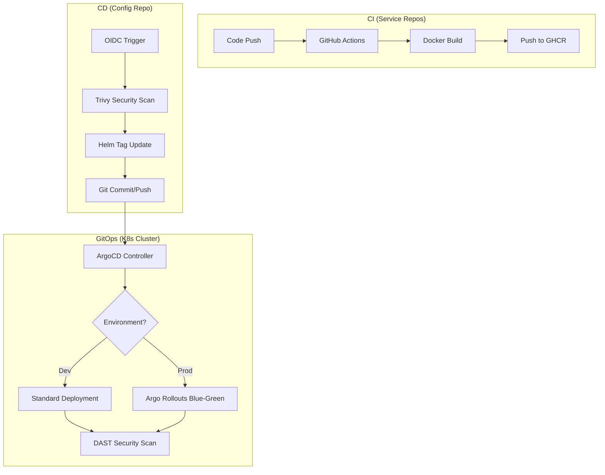

# 🚚 QuickHaul GitOps & Continuous Delivery

This repository serves as the **Source of Truth** for the QuickHaul microservices ecosystem. It implements a state-of-the-art GitOps workflow using **ArgoCD**, **Argo Rollouts**, and **GitHub Actions** to ensure secure, automated, and zero-downtime deployments.

---

## 🏗️ System Architecture



---

## 🚀 The 6 Pillars of QuickHaul CD

| Pillar | Technology | Purpose |
| :--- | :--- | :--- |
| **1. Security Gate** | **Trivy** | Automated image scanning for CRITICAL/HIGH vulnerabilities before deployment. |
| **2. Automated Sync** | **Helm & Git** | CD workflow automatically updates `values.yaml` image tags based on CI triggers. |
| **3. Secure Auth** | **OIDC** | Secret-less authentication between GitHub and the Cluster/Registry. |
| **4. GitOps Engine** | **ArgoCD** | Continuously synchronizes the cluster state with this repository. |
| **5. Runtime Security** | **DAST (OWASP ZAP)** | Dynamic scanning of live endpoints after every deployment to find runtime flaws. |
| **6. Zero-Downtime** | **Argo Rollouts** | Implements Blue-Green deployments in Production for instant rollbacks. |

---

## 🌐 Environments

| Feature | Development (`quickhaul-dev`) | Production (`quickhaul-prod`) |
| :--- | :--- | :--- |
| **Strategy** | Rolling Update (Standard) | Blue-Green (Argo Rollouts) |
| **Replicas** | 1 per service | 3 per service (High Availability) |
| **Namespace** | `quickhaul-dev` | `quickhaul-prod` |
| **Storage Path** | `/mnt/nfs/mongodb-dev` | `/mnt/nfs/mongodb-prod` |
| **Security** | Internal Scans | Internal + Public DAST Scans |

---

## 🛠️ Cluster Bootstrapping

To set up a new cluster from scratch, follow these steps in order:

### 1. Initialize Namespaces & Secrets
```bash
# Create Namespaces
kubectl apply -f helm-charts/templates/namespace-dev.yaml
kubectl apply -f helm-charts/templates/namespace-prod.yaml

# Create Image Pull Secrets (Required for Private GHCR)
kubectl create secret docker-registry regcred \
  --docker-server=ghcr.io \
  --docker-username=<user> \
  --docker-password=<pat> \
  --namespace=quickhaul-dev
```

### 2. Install Controllers
```bash
# Install ArgoCD
kubectl create namespace argocd
kubectl apply -n argocd -f https://raw.githubusercontent.com/argoproj/argo-cd/stable/manifests/install.yaml

# Install Argo Rollouts
kubectl create namespace argo-rollouts
kubectl apply -n argo-rollouts -f https://github.com/argoproj/argo-rollouts/releases/latest/download/install.yaml
```

### 3. Deploy Applications
```bash
kubectl apply -f argocd-apps/dev-apps.yaml
kubectl apply -f argocd-apps/prod-apps.yaml
```

---

## 🔐 Security Integration

### OIDC & Image Updates
The repository uses `.github/workflows/oidc-image-update.yml` to handle automated image updates. This workflow:
1.  Verifies the caller via OIDC.
2.  Runs a **Trivy** scan.
3.  Updates the Helm chart.
4.  Waits for ArgoCD sync.
5.  Runs an **OWASP ZAP Full Scan (DAST)** against the live environment.

---

## 📞 Support & Maintenance
*   **Check Rollout Status**: `kubectl argo rollouts get rollout <service> -n quickhaul-prod`
*   **Manual Sync**: Use the ArgoCD UI or `argocd app sync <app-name>`
*   **Logs**: `kubectl logs -l app=<service> -n quickhaul-dev`
